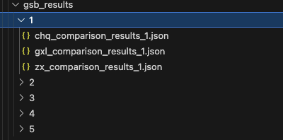

# GSB 测评操作说明
### GSB测评介绍：比较两个模型产生的图片，谁更好或者更坏。 一个测评一般为两列模型的数据，一列是origin模型,另一列是进行过某些性能改进后的模型，如果有多个改进后的模型，需要多个测评，这些模型都是和origin比。
### 代码运行
#### 生成测评文件：
```python
## 修改gsb_index_upload.py 的file_list (即各个改进后模型生成图片的地址) 后即可 
```
运行上述文件后，会生成多个html文件，study_{index}.html里的index 对应file_list里的各个模型。
#### 启动服务器接收文件端口
运行server_flask.py即可 之后用户点击提交结果会存储在gsb_result文件夹中，按照不同的模型创建不同的文件夹，不同用户不同文件

#### 分析结果
修改eva_gsb_index.py的root_dir 为实际生成结果路径 然后运行即可